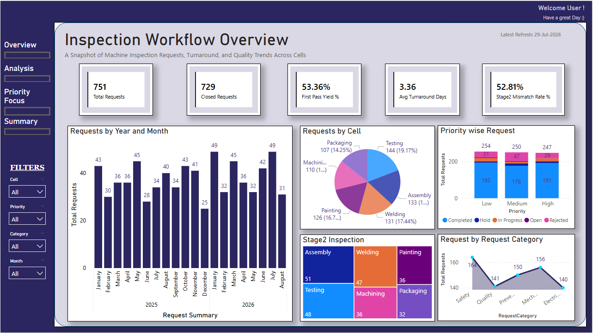
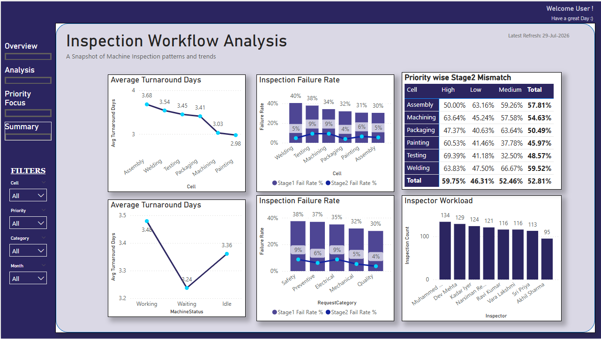
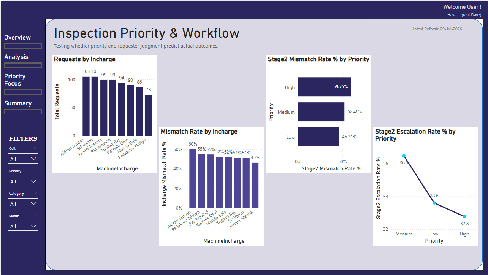
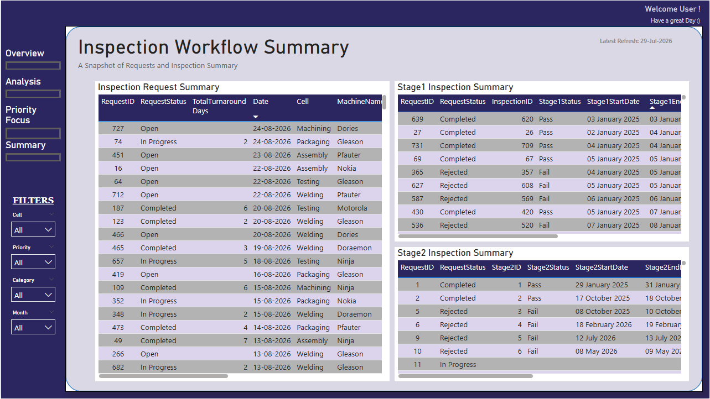
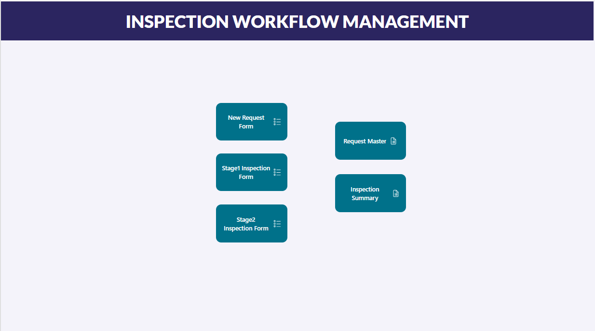
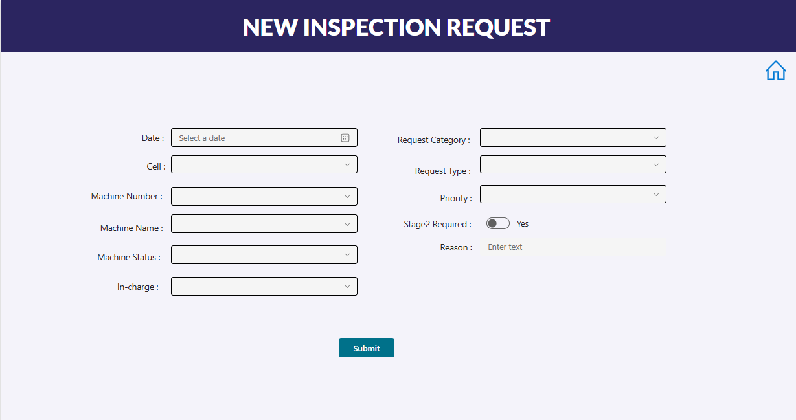
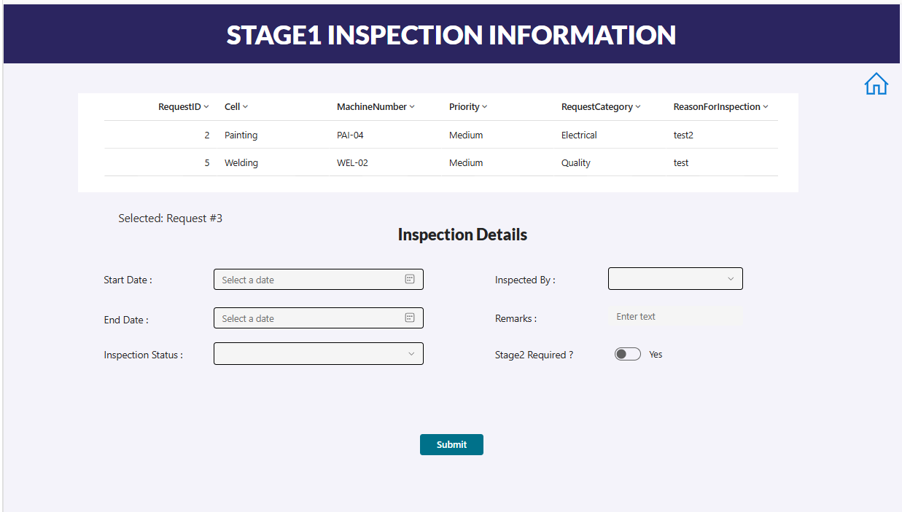
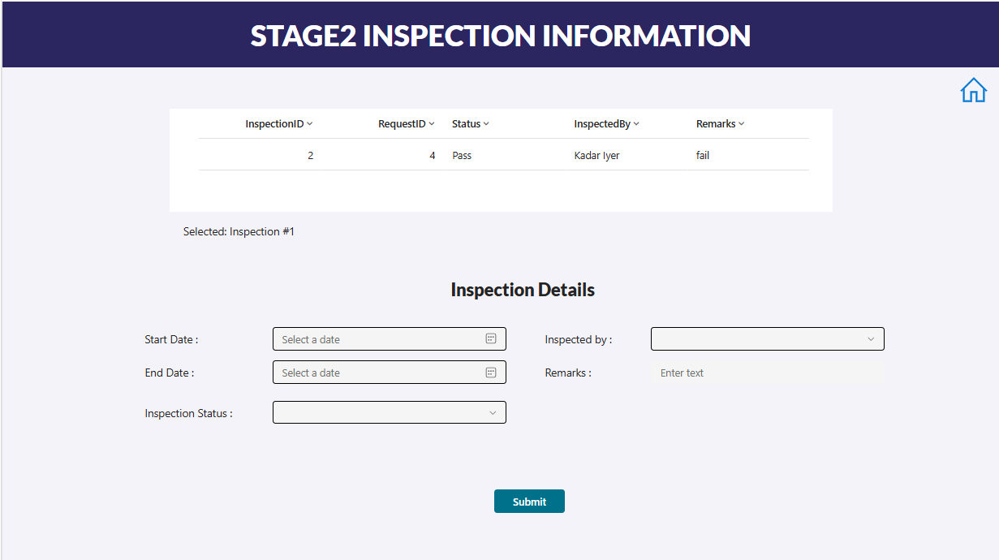
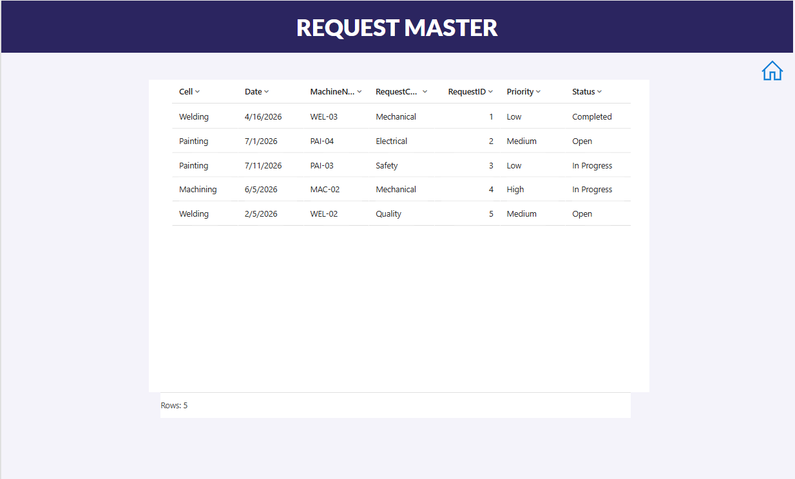
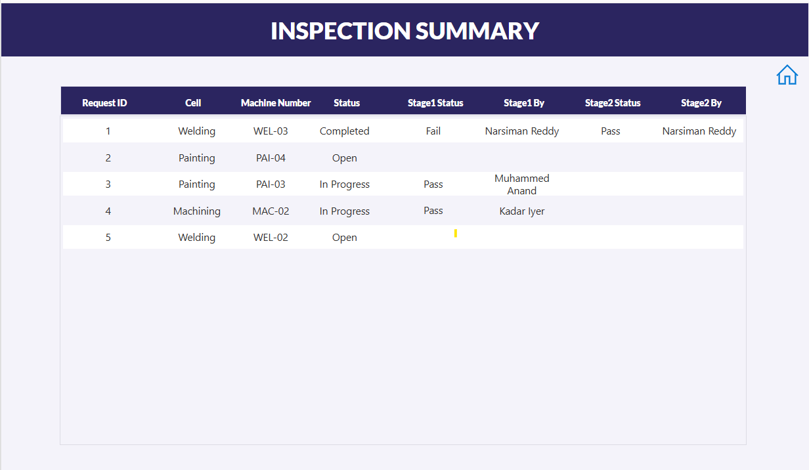

# Inspection Workflow — Manufacturing Quality Inspection System

An end-to-end data project simulating a plant-floor inspection process: a **Power App** front end for raising and logging inspection requests, a **SQL/Python** pipeline for cleaning and analysis, and a **Power BI** dashboard for reporting.

Unlike a typical "load a CSV and build a dashboard" project, this one starts from **app design** — the data doesn't exist until a form is filled out — which meant designing a two-sided workflow (machine in-charge vs. quality inspector) before any analysis could happen.

---

## The Scenario

A manufacturing plant with 6 cells (Assembly, Machining, Welding, Painting, Packaging, Testing), each with several machines. When something needs checking, a machine in-charge raises an inspection request. The quality team picks it up, inspects, and logs a result. Some inspections require a follow-up **Stage 2** inspection before the request is considered closed.

```
Machine In-Charge          Quality Team               Quality Team
   raises a          →     performs Stage 1    →      performs Stage 2
  request (Power App)      inspection                 inspection (if flagged)
        │                        │                          │
        └────────────────────────┴──────────────────────────┘
                                  │
                            SQLite (storage)
                                  │
                          Python (clean + analyze)
                                  │
                            Power BI (report)
```

---

## Architecture

| Stage | Tool | What happens |
|---|---|---|
| 1. Capture | **Power Apps** | Two-sided form: request submission + inspector logging (Stage 1 & Stage 2) |
| 2. Storage | **SQLite** | Three related tables — `Requests`, `InspectionStage1`, `InspectionStage2` |
| 3. Processing | **Python (pandas)** | Joins, duration calculations, KPI computation |
| 4. Reporting | **Power BI** | 4-page interactive dashboard with DAX measures |

**A note on the Power App:** it's presented here as a **front-end prototype** rather than a live production app. It runs on local Power Apps Collections (in-memory, non-persistent) rather than a connected backend, since the environment this was built in didn't have SharePoint or Dataverse access. In a production setting, this front end would connect to SharePoint Lists or Dataverse for persistent storage — the schema and form logic were designed with that in mind, but the actual sample data for analysis was generated synthetically and run through the SQL/Python/Power BI pipeline independently, to keep the analysis fully reproducible.

---

## Data Model

```
Requests (1) ──< InspectionStage1 (1) ──< InspectionStage2
```

- **Requests** — Date, Cell, Machine, Category, Type, Priority, Machine Status, Reason, Incharge, Status
- **InspectionStage1** — linked to a Request; Start/End Date, Pass/Fail, Inspector, Remarks, whether Stage 2 is required
- **InspectionStage2** — linked to a Stage 1 record; same shape, logged only when flagged

Request status moves through: `Open → In Progress → Completed / Rejected / Hold`, driven by the outcome of Stage 1 and (if triggered) Stage 2.

---

## Key Insights

**First-Pass Yield: 53.5%** — just over half of all inspected requests pass Stage 1 cleanly with no follow-up needed.

**Requester vs. Inspector reliability isn't flat across priority.** Comparing what machine in-charges predicted (`Stage2FlagRequested`) against what inspectors actually confirmed (`Stage2Required`) shows requesters are noticeably more reliable at correctly ruling out a Stage 2 need on **Low**-priority requests than on **High**-priority ones — where the mismatch rate is closer to a coin flip. This suggests "priority" as entered by requesters carries real signal at the low end but is much noisier at the high end.

**Inspector workload is evenly distributed** — no single inspector is carrying a disproportionate share of the ~730 inspections in the sample dataset, and fail rates vary 20–40% across inspectors without an obvious outlier.

**Defect patterns by category:** Safety and Mechanical categories show the highest fail rates (~35%), Preventive the lowest (~30%) — consistent with what you'd expect operationally (preventive checks catching issues before they become failures).

---

## Power BI Dashboard

Four pages, built around a dark navy / light lavender theme:

**Overview** — headline KPIs, request volume by cell and month, priority mix, category breakdown


**Analysis** — turnaround time by cell, inspector workload, fail rate by cell and category


**Priority Focus** — requester reliability by machine in-charge, priority vs. Stage 2 mismatch and escalation rate


**Summary** — full row-level detail table across the request/inspection pipeline


---

## Power App

A 6-screen prototype: Home, New Request, Request Master, Stage 1 Inspection, Stage 2 Inspection, and Inspection Summary — each styled to match the Power BI dashboard's theme.

**Home** — navigation hub


**New Request** — the form a machine in-charge fills out to raise an inspection


**Stage 1 Inspection** — quality team selects an open request and logs the first inspection result


**Stage 2 Inspection** — follow-up inspection for requests flagged during Stage 1


**Request Master** — full list of all submitted requests


**Inspection Summary** — joined view showing each request's full inspection trail


---

## Tech Stack

- **Power Apps** (Canvas app, Power Fx)
- **SQLite** (via the `alexcvzz` VS Code extension)
- **Python** — pandas for data generation, joins, and KPI calculation
- **Power BI** — DAX measures, custom theming, multi-page report design

---

## Repository Structure

```
├── README.md
├── sql/
│   ├── create_table.sql       # schema: Requests, InspectionStage1, InspectionStage2
│   ├── inserts.sql            # manual test/edge-case records
│   └── codes.sql              # ad hoc queries used during development
├── python/
│   ├── sample_data.py         # generates synthetic requests + inspections
│   └── py_codes.py            # load, join, duration calcs, KPI computation
├── inspection.db              # SQLite database (schema + sample data)
├── powerbi/
│   ├── Dashboard.pbix          # 4-page Power BI report
│   └── powerbi_exports/        # CSV exports used as the Power BI data source
├── powerapp/
│   └── InspectionWorkflow.msapp   # exported Power App source
└── screenshots/
    ├── powerbi_*.png
    └── powerapp_*.png
```
---

## Requirements

- **Python 3.9+** with `pandas` (`pip install pandas`)
- **SQLite** — no separate install needed if using the `alexcvzz.vscode-sqlite` extension in VS Code, or any standard SQLite client
- **Power BI Desktop** (free) to open `Dashboard.pbix`
- **Power Apps** license (a free/trial tenant works) to open `InspectionWorkflow.msapp` — only needed if you want to edit or run the app itself; the screenshots in this README show it fully built

---

## How to Reproduce

1. **Create the database**
   Run `sql/create_table.sql` against a new `inspection.db` (e.g., via the SQLite VS Code extension, or `sqlite3 inspection.db < sql/create_table.sql`).

2. **Generate sample data**
   ```
   python python/sample_data.py
   ```
   This populates `Requests`, `InspectionStage1`, and `InspectionStage2` with ~750 synthetic requests spread across an 18-20 month window. Optionally run `sql/inserts.sql` afterward to add the manual edge-case records.

3. **Run the analysis and export for Power BI**
   ```
   python python/py_codes.py
   ```
   This loads the three tables, joins them, computes durations/turnaround/KPIs, and exports the CSVs into `powerbi_exports/` — including `inspection_master.csv`, the main table Power BI reads from.

4. **Open the dashboard**
   Open `powerbi/Dashboard.pbix` in Power BI Desktop. If the file paths don't match your local folder structure, update the Source step for each query in **Transform data → Data source settings**, then **Refresh**.

5. **Explore the Power App (optional)**
   Import `powerapp/InspectionWorkflow.msapp` into a Power Apps environment to view or edit the app. Note: it runs on local Collections rather than a live data source (see the note under Architecture), so submitted data won't persist between sessions — it's a front-end prototype, not a connected app.

---

## About This Project

This is the third in a series of portfolio projects exploring the same core pipeline (Power Apps → SQL → Python → Power BI). Where the previous project used a synthetic dataset loaded directly into Power BI, this project starts one layer earlier — designing the data capture itself — which meant working through form design, a two-sided workflow, and the tradeoffs of building a Power App prototype without a live cloud backend.

---

## Author
**Kanageswari**
Data Analyst | Power BI | Python | SQL
[LinkedIn Profile](https://www.linkedin.com/in/kanageswari-m/)
